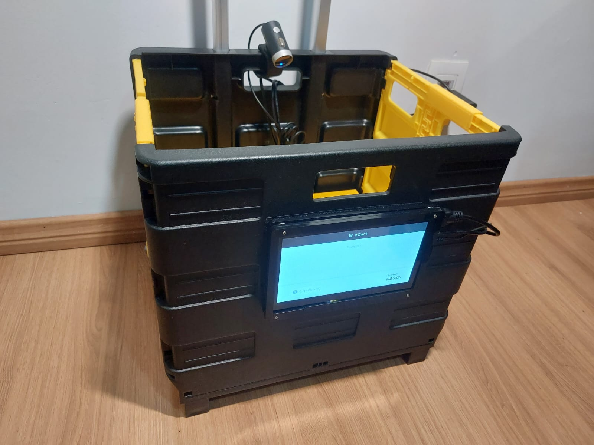
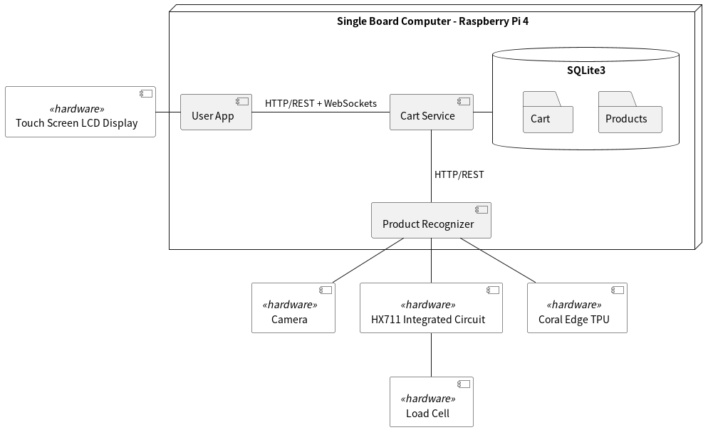

# zcart

Repository for our final undergraduate project.

The latest version of the thesis can be seen [here](https://zcart-tcc.s3.sa-east-1.amazonaws.com/latest.pdf)

This README is still a WIP.

## Architecture

## Useful links
- [Board](https://github.com/fsmiamoto/zcart/projects/1)
- [Drive](https://drive.google.com/drive/folders/1tiI2ZUKdb-87AAcgF8CQZQdwKzWc4FmO?usp=sharing)
